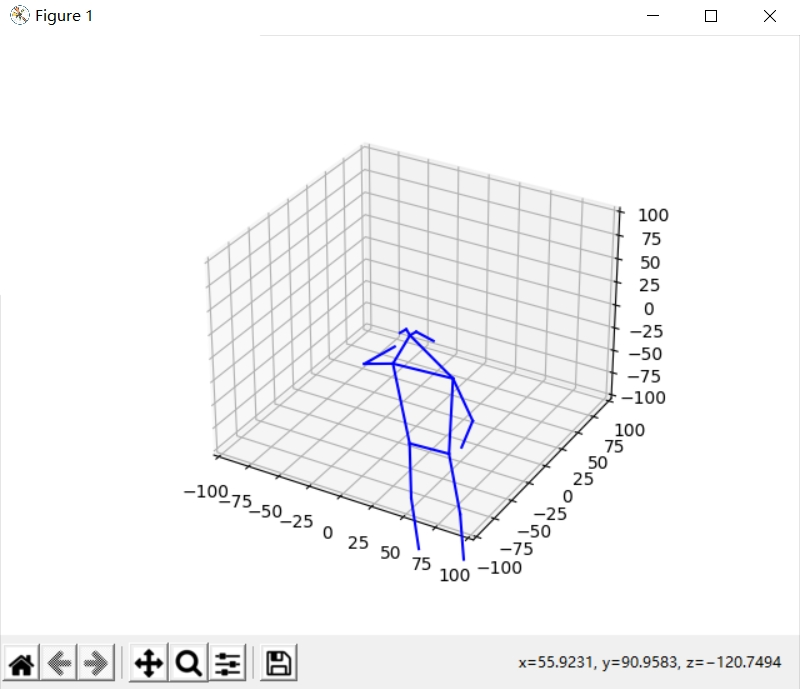

# Human Pose Classification

## Introduction

A project of Human Pose Classification with LSTM.

The final homework of the scoure Artificial Intelligence Comprehensive Experiment in ISE, SYSU.



For more details, please read `show.pptx`(Simple Chinese).

**Tercher:** Liu Mengyuan

**Group Member:** Deng Yushan, Duan Yuxiao, Ding Yuhao, Deng Zhuotao, Yu Zhanpeng

2021/07/25

### Human pose sequence

If you want to know more about human pose sequence and see what it like, you cound konw more detial in `show.py` which is written by `nkLiu`. You would get the image as before.

## LSTM

Synthesizing the original data form and task characteristics, we choose LSTM, a variant of the RNN model dedicated to sequential signal processing in mainstream algorithms. In this task that is highly related to temporal features, LSTM can deal with long-term dependence issues by avoiding long-term memory and avoiding gradient disappearance or explosion problems. It should be more excellent in the classification of time-series sequence signals.


## Performance

### Speed

|   GPU                 | Trainining | GPU Memory |
| :------:              | :--------: | :---------:|
|   GeForce RTX 2060    |     45 iter/min  | 4 GB |


The training speed is sensitive to your gpu status. 

It could be much slower if you do not have GPU and only run with CPU.

## Install dependencies

- install `TensorFlow`, refer to [official website](https://www.tensorflow.org/). TensorFlow with GPU is faster but not necessery. Code is not GPU only.
  - pip
    ```
    pip install tensorflow
    ```

- install other dependencies:  
```
 pip install numpy 
```

## Load Data

Since the sequences in the data set have different frame numbers, during the process of data loading, this project performs frame-filling operations on the data to increase the frame numbers of all sequences to `350fps`. For the method of frame supplementation, this project uses the mean value method, which means that the gap between any two frames is linearly supplemented.

## Demo

Download pretrained model from [BaiduDisk](https://pan.baidu.com/s/1IhK8TaXyoWyI9cYG7LBr2A) with password：wtcy

See [demo.py](https://github.com/IT-BillDeng/Human-Pose-Classification/blob/main/demo.py) for more detail.

You would get the result as below:

```Bash
Minibatch Loss= 0.15105, 
Testing Accuracy: 0.74358976
Class:000  Test Accuracy: 0.7307692
Class:001  Test Accuracy: 0.7692308
Class:002  Test Accuracy: 0.88461536
Class:003  Test Accuracy: 0.8
Class:004  Test Accuracy: 0.11111111
```

## Train

If you plan to train your own model, you can follow the steps below.

### Prepare data

1. Download the training, test data from [BaiduDisk](https://pan.baidu.com/s/13aUqRV3FRWmYyP66y8hCHQ) with password：stq4

2. Unzip it to the right address

If you are going to use your own data set, please pay attention to the data set format.

### Begin training

See [train.py](https://github.com/IT-BillDeng/Human-Pose-Classification/blob/main/train.py) for more detail.

Some Key arguments:

- `--path` the model path
- `--learning_rate`
- `--training_iters`
- `--batch_size`
- `--Seq_Len` Sequence length
- `--n_hidden` Number of hidden layers
- `--n_classes` Number of classes


